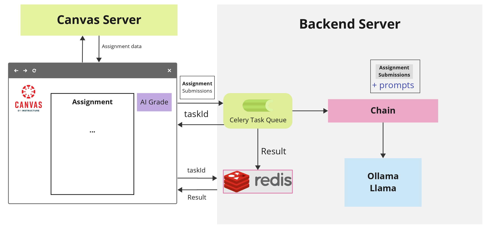
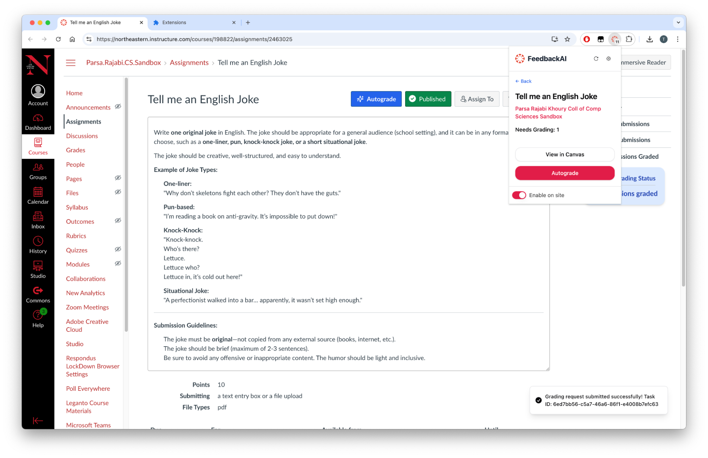
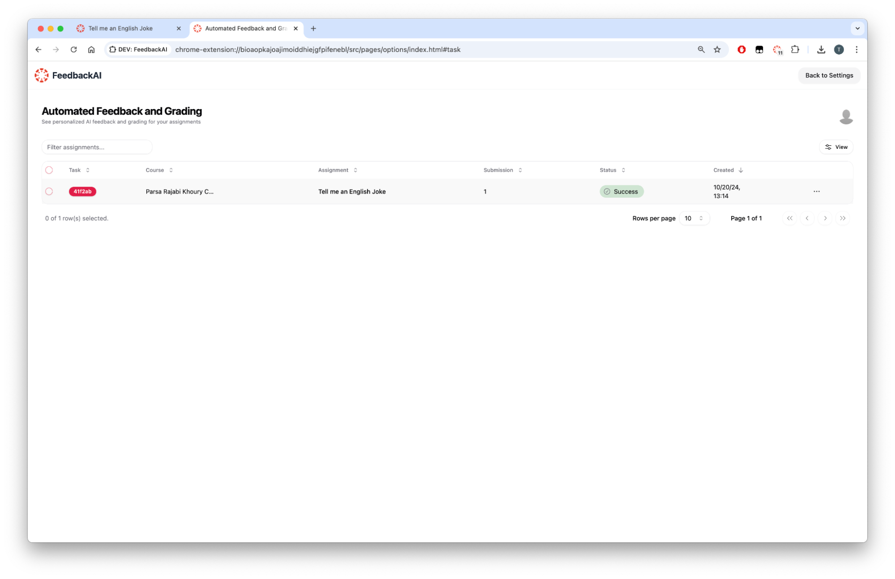
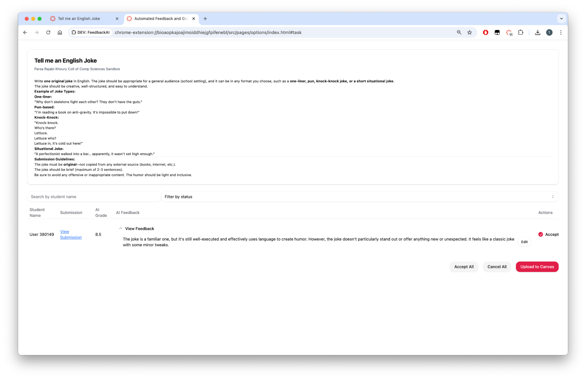
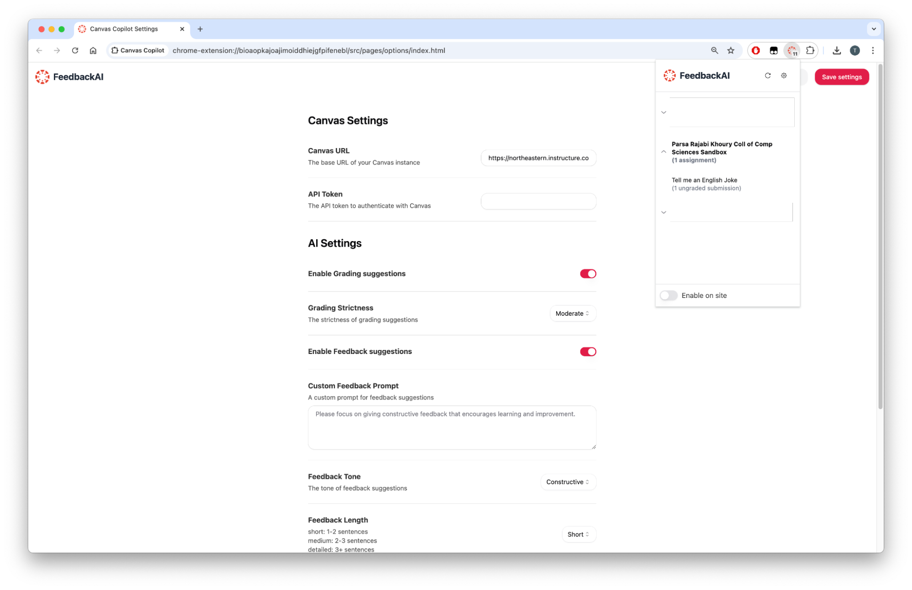
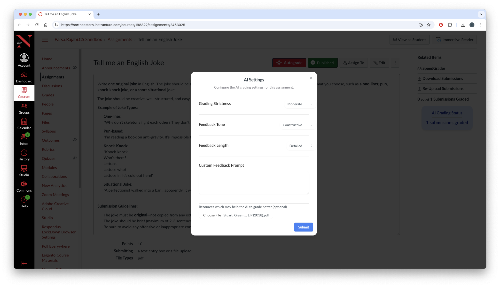
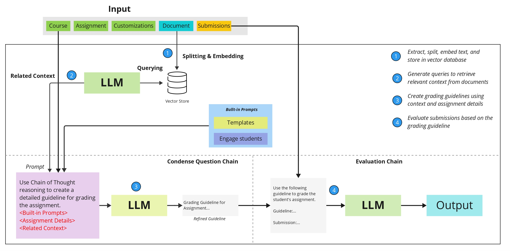

# FeedbackAI

FeedbackAI is an AI-powered grading solution that integrates directly into existing Learning Management System (LMS)—like Canvas—via a Chrome extension. It leverages advanced Large Language Models (LLMs) to efficiently produce personalized, criterion-based feedback for student submissions, all while maintaining strict data privacy and residency compliance.

---

**Key Highlights:**

- **Local LLM Deployment for Privacy Compliance:**  
  FeedbackAI uses locally servers to ensure that sensitive student data never leaves institutional control.

- **Integration with Canvas via Chrome Extension:**  
  The Chrome extension seamlessly embeds into Canvas pages. Instructors can perform grading tasks directly from their familiar LMS environment, enhancing their workflow without requiring platform switches.

- **Personalized, Criterion-Based Feedback:**  
  FeedbackAI uses a two-step reasoning process:

  1. **Guideline Generation:** The LLM first creates a detailed, context-specific grading rubric based on the course, assignment parameters, and instructor customizations.
  2. **Evaluation & Feedback:** Using these guidelines, the LLM then evaluates student submissions, offering tailored, actionable feedback aligned with the instructor’s pedagogical goals.

- **Customizable :**  
  Instructors can adjust feedback length, tone, rubric emphasis, and more.

- **Continuous Improvement via Instructor Input:**  
  Instructors remain in full control. They can review and refine AI-generated feedback before finalizing grades and use thumbs-up/down ratings to help the system iteratively improve its prompt strategies and grading quality.

---

## System Architecture

**System Architecture Diagram:**



**Key Components:**

- **Browser (Client):**  
  The Chrome extension runs in the instructor’s browser, overlays onto Canvas, and sends anonymized assignment data to the backend over secure channels. Processed feedback is then displayed for instructor review.

- **Backend Service:**  
  The backend handles authentication, assignment retrieval, LLM prompt preparation, and feedback generation. All computations occur on regionally compliant servers to ensure data remains within the required jurisdiction.

- **Local LLM Integration:**  
  The LLM (e.g., Llama via Ollama) runs locally or regionally, keeping all data processing within controlled environments to maintain compliance and privacy.

---

## Screenshots

1. Assignment Page:
   An Autograde button is added to the Canvas assignment page, allowing instructors to trigger the AI grading process.
   

2. Dashboard:
   A centralized interface for instructors to manage and review grading progress.
   

3. Review Interface:
   The interface where instructors can view AI-generated feedback and score, edit as necessary, and finalize grades.
   

4. Settings Page:
   Instructors can customize grading parameters, feedback tone, and integration settings for a personalized grading experience.
   

5. AI Settings for Grading:
   Instructors can configure AI grading settings, including grading strictness, feedback tone, feedback length, and add reference file to guide the AI’s evaluation process.
   

---

## Two-Step Reasoning and Evaluation Process

FeedbackAI employs a “Chain of Thought” prompting technique:

1. **Guideline Generation Phase:**  
   The LLM creates a transparent grading rubric using course details, assignment descriptions, and instructor preferences.

2. **Evaluation & Feedback Phase:**  
   The LLM applies the generated rubric to each student submission, producing criterion-based feedback. The instructor can then refine and finalize this feedback before returning grades to Canvas.

**Two-Step Process Diagram:**



---

## Repository Structure

```
feedbackai/
├─ backend/
│  └─ ... (Backend server and API code)
├─ chrome-extension/
│  └─ ... (Chrome extension source code)
└─ README.md
```

- **backend/**:  
  Contains server-side code and detailed setup instructions. See [backend README](backend/README.md) for setup details.

- **chrome-extension/**:  
  Houses the extension code that interacts with Canvas LMS, displays AI feedback, and provides instructor-facing UI elements. See [Chrome Extension README](chrome-extension/README.md) for installation and usage instructions.

---

**FeedbackAI** aims to be an indispensable tool for educators, merging the power of AI-driven grading with strong data privacy, regulatory compliance, and seamless user experiences—all to enhance learning outcomes and streamline the grading process.
